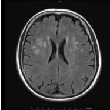
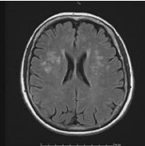
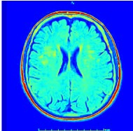
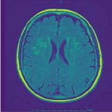
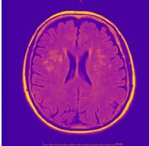
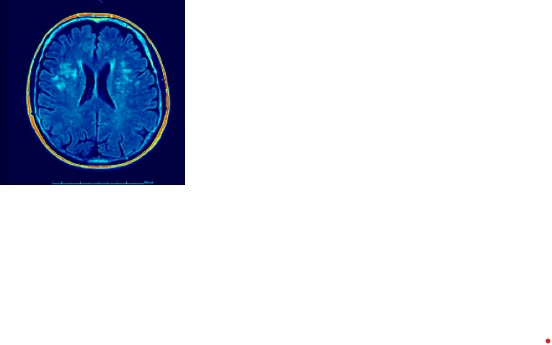

# Colorization of Brain MRI Images

## 📌 Project Overview
This project focuses on **enhancing and colorizing brain MRI images** to improve visualization for medical analysis. The code applies multiple colormaps to grayscale MRI scans, with a special **custom colormap** designed to highlight potential tumor regions.

## 🚀 Features
- **Image Preprocessing:** Enhances grayscale MRI images for better contrast.
- **Colorization:** Applies multiple colormaps, including Jet, Viridis, Plasma, and a custom colormap designed for tumor detection.
- **Automatic Image Processing:** Reads images from a dataset, enhances, colorizes, and saves them in an organized manner.
- **Visualization:** Displays a comparison of different colormaps applied to MRI images.

## 🛠️ Technologies Used
- **Python** 🐍
- **OpenCV** - Image processing
- **NumPy** - Numerical computations
- **Matplotlib** - Data visualization
- **Pathlib** - File management
- **TQDM** - Progress tracking

## 📂 Dataset
The project uses brain MRI images categorized as:
- **Yes** (Tumor present)
- **No** (No tumor)

Ensure that your dataset follows this directory structure:
```
/dataset_root/
    ├── no/    (MRI scans without tumors)
    ├── yes/   (MRI scans with tumors)
```

## 📌 How to Run the Project
### 1️⃣ Clone the Repository
```bash
git clone https://github.com/yourusername/brain-mri-colorization.git
cd brain-mri-colorization
```
### 2️⃣ Install Dependencies
Ensure you have Python installed, then install the required libraries:
```bash
pip install -r requirements.txt
```
### 3️⃣ Run the Code
```bash
python main.py
```
This will process the images and save the colorized versions in an output directory.

## 📊 Example Outputs
The program generates colorized images like:
| Original | Enhanced | Jet | Viridis | Plasma | Custom |
|----------|----------|------|---------|--------|--------|
|  |  |  |  |  |  |

## 📜 License
This project is open-source and available under the **MIT License**.

## 🤝 Contributing
Feel free to fork this repository, open issues, or submit pull requests to improve the project!

---
### 📬 Contact
For any questions or collaborations, reach out via [your email or GitHub profile link].

